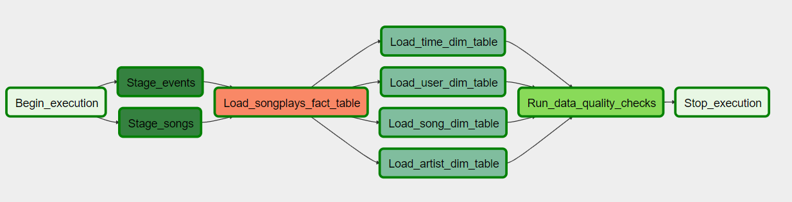

# Sparkify Airflow Data Pipeline

## Purpose
The purpose of this Airflow pipeline is to add an additional layer of automation and monitoring to the ETL processes that feed into the Sparkify Data warehouse. The implemented Airflow pipeline reads user session and song data from S3, loads the data into staging, and then populates dimension and facts tables in RedShift.

## Prerequisites
Before running this pipeline, the following steps must be completed:
1. Staging, Dim, and Fact tables must be created in Redshift. This can be done using the <code> create_tables.sql </code> file.
2. AWS credentials and Redshift Connections must be configured in Airflow

## Overview of Pipeline Tasks

This design allows for events and song staging tables to created in parralel, before loading the songplays fact table. Once the fact table is loaded, the time, user, artist, and song tables are also loaded in parralel. Finally once, all of the data is loaded, a quality check step is implemented to check that there is data in the respective tables. 

The following python scripts were used to develop this pipeline:

- <code>app_dag.py</code>: Defines the dag and assigns operators to each respective task in the Airflow pipeline. Additionally, it dictates the sequence of tasks at the bottom of the file.
- <code>sql_queries.py</code>: Defines SQL queries to read and load staging, fact, and dim tables. Found in plugins/helpers directory
- <code>stage_redshift.py</code>: Defines StageToRedshiftOperator that reads from S3 and writes to staging tables in AWS Redshfit
- <code>load_fact.py</code>: Defines LoadFactOperator that extracts data from staging into songplays (or otherwise defined) fact table
- <code>load_dimension.py</code>: Defines LoadDimensionOperator that extracts data from staging into the song, user, artist, and time dim tables
- <code>data_quality.py</code>: Defines DataQualityOperator that counts the rows in each table to ensure data has been written to RedShift

